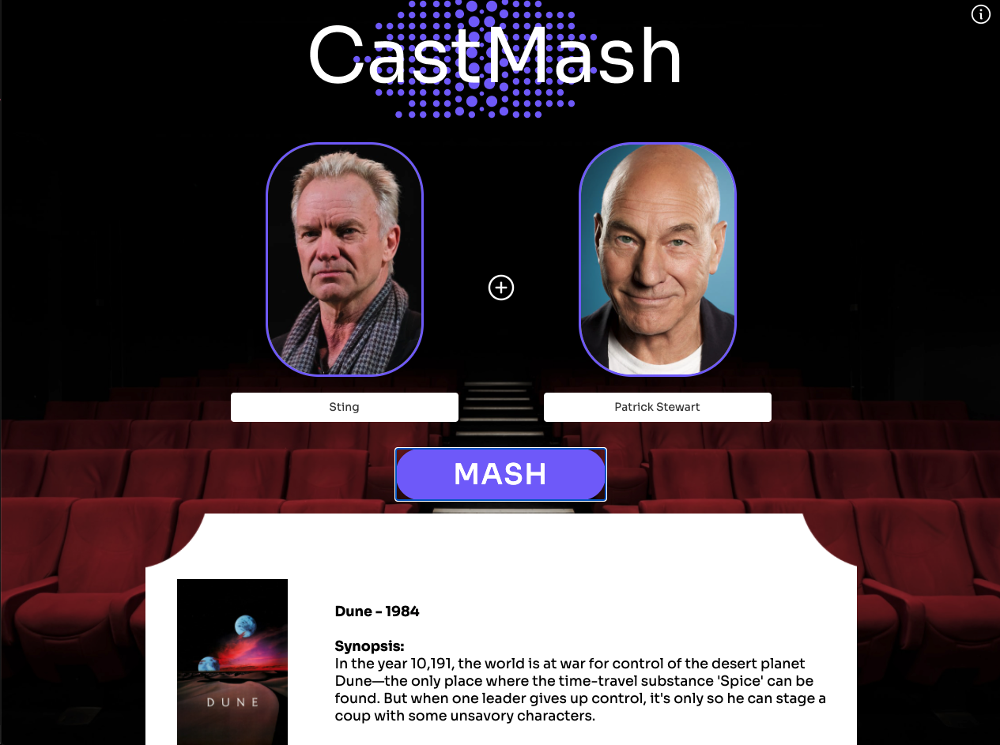

# Cast-Mash
## Deployed Site
[Cast Mash](https://cast-mash.netlify.app/)

## About
Cast Mash takes two actors and "Mashes" them together to find out what movies they've both been in.  The project was thought up, designed, and programmed in 5 days. 

## Team
### UX/UI
- Michael Dijak
- [Kevin Li](https://www.kevinli.design/)

### API Programming
- [Matt Noth](https://github.com/mattnoth)
- [Noa Kim](https://github.com/noanonoa)

### Front End Team
- [Stephanie Rinehart](https://github.com/mlisdev)
- [Doug Leinen](https://github.com/daleinen7)